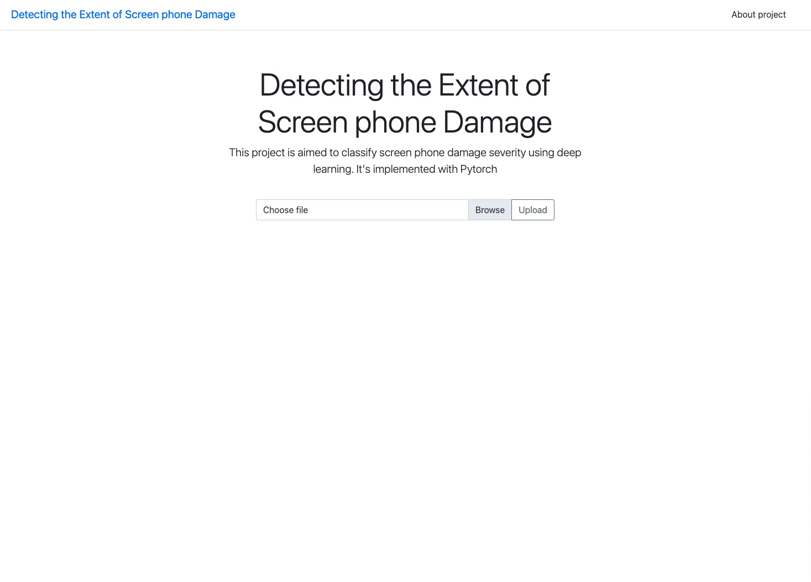
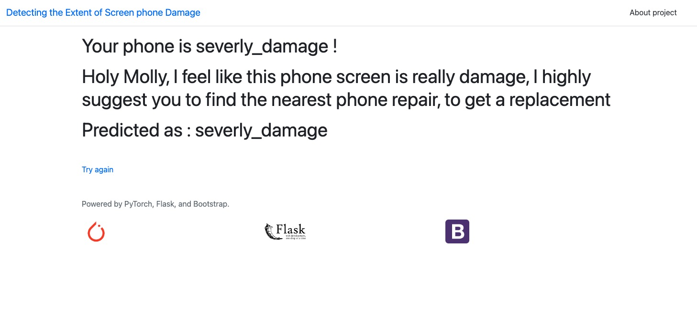

## Phone Screen Damage Classification



### Description 

The goal of this project is to build a classification model to predict the severity of phone screen damage. To achieve that goal, The model is training using 3 different classes which are: 

1. Not Damage : - It means the phone screen is not damage.
2. Less Damage : - It means the phone screen is less damage
3. Severely Damage : - It means the phone screen is severely damage. 
4. low confidence : It means that the user might upload completely different images, or it's not a picture of a phone.

By making 3 different classes, it would be easier to identify & classify, and achieve the goal, and objective set for this project.

### Demo 

- To check the demo & see the result, please click on this link [Here](https://detect-screen-phones.onrender.com/)
- The demo might be slow in response, it's due to been deployed in a free hosting resource online. 
- To speed up the response of the API is to allocate more resource and move to the paid resource, so that it would be much faster if it's needed.
- Hence, it's served the idea Testing, and Seen the demo 


### Usage 


### How to Run The project

<h5> Create a Python Environment </h5>

First check if you've python installed in your computer or not. then if you don't have please installed python first, and follow this guideline

Install virtual environment 
---
```
pip install virtualenv

```
---

To use venv in your project, in your terminal, create a new project folder, cd to the project folder in your terminal, and run the following command:

---
```
python<version> -m venv <virtual-environment-name>
```
---


Like so:
---
```
 mkdir dir_name
 cd dirname
 python -m venv env
```
---
 then activate your env
---
```
source env/bin/activate
```
---

Then install the package to use the flask app
---
```
pip install -r requirements.txt
```
---

Then run the app locally once you installed all the packaged successfully.

---
```
python app.py
```
---

Then you go, you can now use the project locally to test it. 

<h5> Train your model on jupyter notebook </h5>

Just run accordingly, and add the path of your datasets, and then it would work smoothly. Hence, once you trained a new model, you can just replace the model in the flask app, and it would work accordingly.


### Results 


